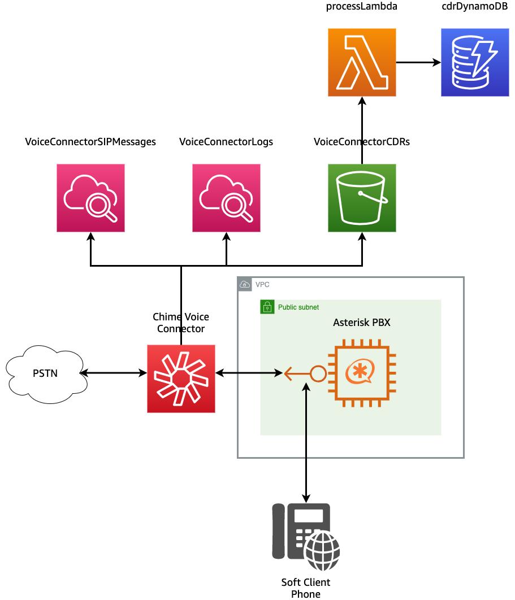

## Overview



### Logging in to Server
-   ssh to Asterisk: `ssh -i cdk-key.pem -o IdentitiesOnly=yes ec2-user@<YOUR_SERVER_IP>`
-   get access to root: `sudo bash`
-   check to see if config completed: `tail -f /var/log/cloud-init-output.log`

should see something like:
```
chown -R asterisk.asterisk /var/lib/asterisk /var/log/asterisk /var/spool/asterisk systemctl start asterisk
```

### Capturing traffic

-   install Wireshark: `yum install wireshark -y`
-   capture SIP messages to screen: `tshark -f "udp port 5060"`
-   capture SIP messages to file: `tshark -f "udp port 5060" -w /tmp/capture.pcap`
-   capture SIP messages and audio to file: `tshark -f "udp" -w /tmp/capture.pcap`

### Transfering pcap to local machine
-   change ownership of file to ec2-user: `chown ec2-user /tmp/capture.pcap`
-   copy file down to local machine: `scp -i cdk-key.pem -o IdentitiesOnly=yes ec2-user@<YOUR_SERVER_IP>:/tmp/capture.pcap ./`

