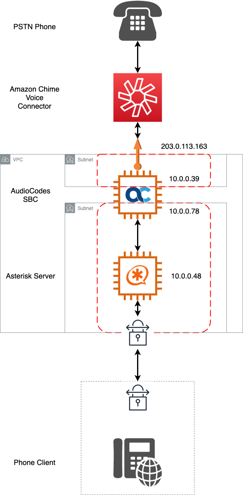
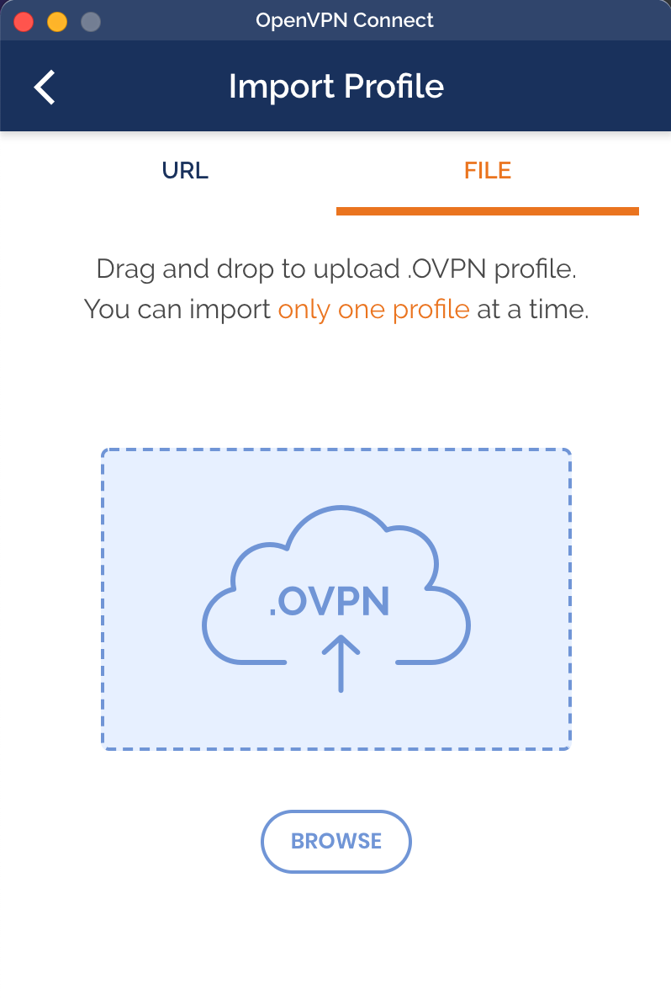
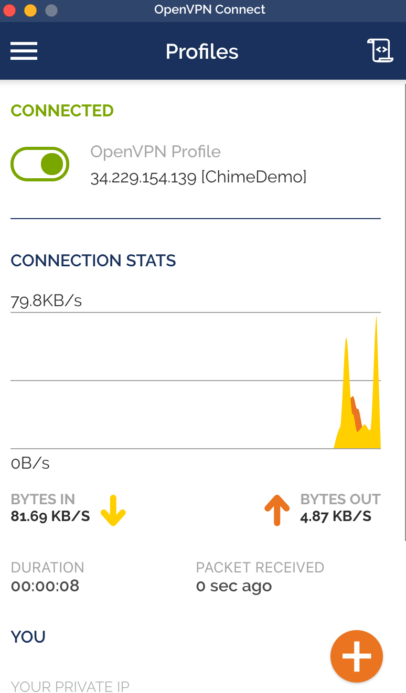

# Amazon Chime Voice Connector with an SBC

This week's episode builds upon many of the previous versions.  Check the requirements and processes [here](https://github.com/aws-samples/building-with-amazon-chime/tree/main/week-01#chime-voice-connector-with-asterisk-demo) to get the basic deployment done as well as the configuration of the VoIP client.  However, there will be a few notable changes.

## Overview

This is a fairly major overhaul of the VoIP connectivity with the addition of a VPN and SBC.  This is being done to more accurately reflect common design scenarios.  
### VPN Connectivity

In this demo, an OpenVPN server is added to the Asterisk server.  This is not how a deployment would likely look in production, but serves as a way to emulate a private PBX network.  

OpenVPN will be installed and configure on the Asterisk server.  Then, a profile will be created that you can download and use in a local VPN client.

The script to deploy OpenVPN can be found [here](https://github.com/angristan/openvpn-install) and is part of the Asterisk build already.  The CDK output includes a command that will allow you to download the created profile from the Asterisk server.  The OpenVPN client can be found [here](https://openvpn.net/vpn-client/)

#### OpenVPN Info
Import the Profile:

Connect:

### SBC Deployment

The largest component added here is the AudioCodes SBC.  One important not regarding this demo is that it requires you to subscribe to the AudioCode PAYG Product in [Amazon MarketPlace](https://aws.amazon.com/marketplace/pp/prodview-4wxi3q2ixfcz2).  This subscription does require you to use a special IAM role and has been included.  

This SBC deployment includes two network Interfaces.  One of these interfaces is used as the connection to Amazon Chime Voice Connector and one interface is used as the connection to the Asterisk server.  This separation of interfaces will allow for further security and routing options in the future and is a very common practice when deploying SBCs.  

If you'd like to experiment more with AudioCodes, be sure to check our their documentation on using an [SBC with Amazon Chime Voice Connector](https://www.audiocodes.com/media/14694/mediant-ve-sbc-with-amazon-chime-voice-connector.pdf).

AudioCodes includes some useful tools that we'll also be discussing that can be found [here](http://redirect.audiocodes.com/install/index.html).

To log in to the AudioCode, connect to the public IP address and use these credentials:
- Login: Admin
- Password: INSTANCE_ID

The instance ID can be found in the EC2 Console and is also included in the CDK output.  This will change for every deployment.  

#### Configuring the SBC

Once logged in, the SBC will need to be configured.  An incremental configuration file is included in this demo and can be used to quickly configure your SBC.  From the SBC UI: SETUP -> ADMINISTRATION -> Maintenance -> Auxiliary Files -> INI file (incremental)

A file has been created for you as part of the deployment that can be used to configure your SBC.  Choose the SBC_CONFIG/SBC_Config.ini file from this local directory and Load File.  

### Asterisk Changes

Because we are using a VPN to connect to the Asterisk now, a few things will change.  Because the SBC is being used to get from a private network space to the public Internet space, all communication from the Asterisk to the SBC is done using private network address space.  This means that that the IP address used in the VoIP client will now be the private IP address and will only be usable when connected to the VPN.  
