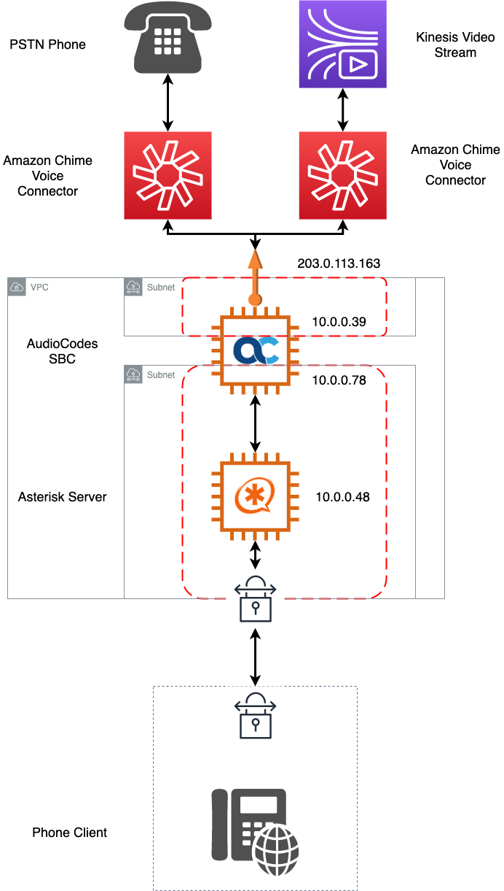

# Amazon Chime Voice Connector with an SBC and SIPREC

This week's episode builds upon many of the previous versions but especially last week's build of an AudioCode SBC.  Check the requirements and processes [here](https://github.com/aws-samples/building-with-amazon-chime/tree/main/week-05#amazon-chime-voice-connector-with-an-sbc).  The basics aren't going to change.  The VoIP client will still connect through a VPN and the SBC should be configured through the produced .ini file.  

## Overview

The change here is with the addition of the SIPREC path from the SBC to a new VoiceConnector.  This VoiceConnector is configured to support streaming to Kinesis Video Streams.  

### SBC Deployment

The main SBC deployment is no different from last week's deployment.  Documentation for configuring the SIPREC components can be found [here](https://www.audiocodes.com/media/14650/mediant-sbc-for-amazon-chime-voice-connector-siprec-configuration-note.pdf).  These configurations have been done as part of the build and can be found in the SBC_Config directory.

### Additional Deployments (Optional)

Two additional repositories can be used as part of this deployment for additional enhancements.  

[Real-Time Transcription with Amazon Chime Voice Connector](https://github.com/aws-samples/amazon-chime-voiceconnector-transcription)

This repository will help deploy services that will capture the media on the KVS stream and transcribe the speech detected and output to a DynamoDB and Web Socket.  

[AI-powered Speech Analytics with Amazon Chime Voice Connector](https://github.com/aws-samples/chime-voiceconnector-agent-assist)

This repository will assist with the previous repository and present the live transcription.  
